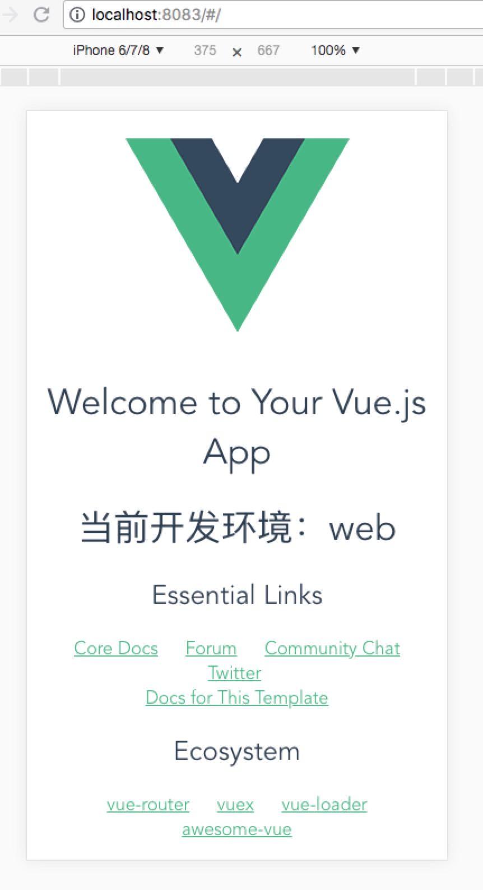
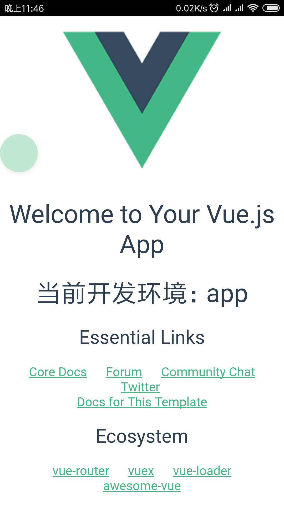

# APICloud-vue-quickstart

APICloud 结合 vue 快速开发 App ，可同时开发 web 端和 app 端。

[APICloud 官方文档](https://docs.apicloud.com/) | [Vue 官方文档](https://cn.vuejs.org/)

## 如何使用本项目模板

本模板使用 [`vue-cli`](https://github.com/vuejs/vue-cli) 来初始化项目，首先需要安装 `@vue/cli` （已安装可跳过）
``` bash
npm install -g @vue/cli
```

目前 `@vue/cli` 已经更新到 `3.x` 了，本模板是 `2.x` 的模板，所以在安装完 `@vue/cli` 后，还需要安装 `@vue/cli-init`
``` bash
npm install -g @vue/cli-init
```

接着就可以初始化项目了
``` bash
vue init auven/APICloud-vue-quickstart acvue
```

## 开发

安装项目依赖
``` bash
npm install
```

### 开发 web 端

``` bash
# 本地开发，热更新
npm run dev

# 打包
npm run build
```

### 开发 app 端

``` bash
# 本地开发，热更新
npm run dev@app

# 打包
npm run build@app
```

然后到 `APICloud` 相关网站上去[下载开发工具](https://docs.apicloud.com/Download/download)，接着选择 `acapp/widget` 文件夹打开，右键选择 `wifi 全量同步` ，开启 app 的本地开发

### 识别开发环境

- `process.env.PLATFORM` : `app` (app 端) | `web` (web 端)

在我们的项目中，可以使用它来判断当前的开发环境，便于区分不同平台。

### 截图

<div align=center>
  
  
</div>